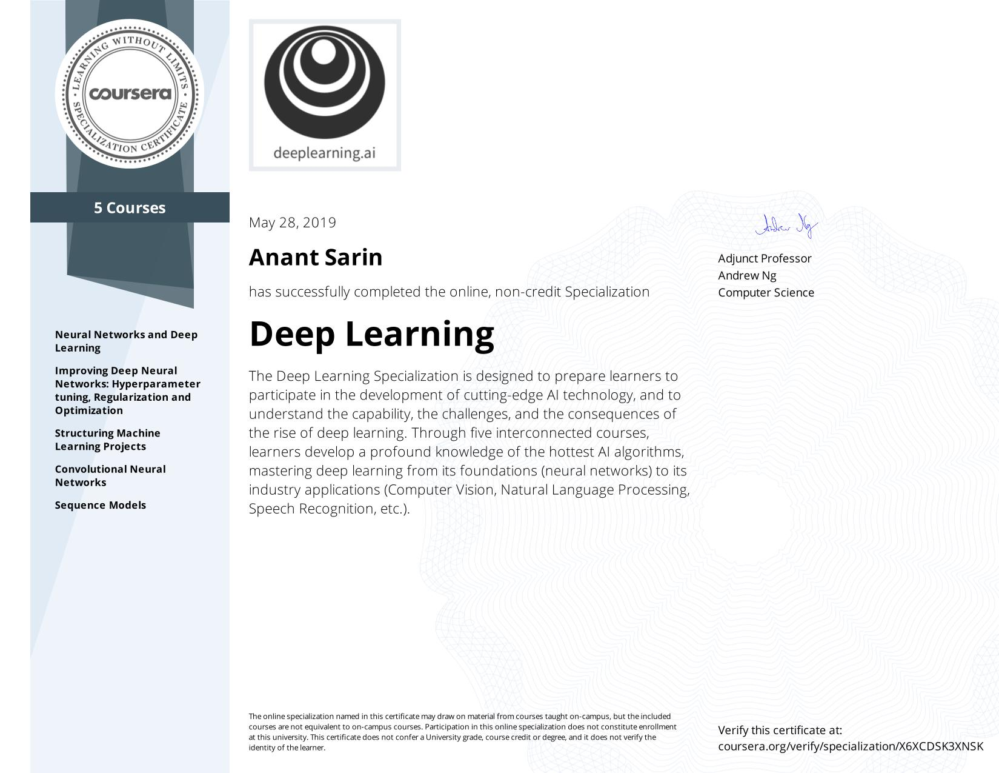

# [AI Deep Learning Specialization](https://www.coursera.org/specializations/deep-learning)
--------
## Completed by Anant Sarin
## May 28, 2019
------

Coursera certifies their successful completion of DeepLearning.AI [Deep Learning Specialization](https://www.coursera.org/specializations/deep-learning).

1. Sequence Models
2. Structuring Machine Learning Projects
3. Neural Networks and Deep Learning
4. Improving Deep Neural Networks: Hyperparameter tuning, Regularization and Optimization
5. Convolutional Neural Networks

Course Certificates Completed

---------

### About Specialization

> If you want to break into AI, this Specialization will help you do so. Deep Learning is one of the most highly sought after skills in tech. We will help you become good at Deep Learning.

> In five courses, you will learn the foundations of Deep Learning, understand how to build neural networks, and learn how to lead successful machine learning projects. You will learn about Convolutional networks, RNNs, LSTM, Adam, Dropout, BatchNorm, Xavier/He initialization, and more. You will work on case studies from healthcare, autonomous driving, sign language reading, music generation, and natural language processing. You will master not only the theory, but also see how it is applied in industry. You will practice all these ideas in Python and in TensorFlow, which we will teach.

> You will also hear from many top leaders in Deep Learning, who will share with you their personal stories and give you career advice.

> AI is transforming multiple industries. After finishing this specialization, you will likely find creative ways to apply it to your work.

> We will help you master Deep Learning, understand how to apply it, and build a career in AI.

------

-------

## Sequence Models
an online non-credit course authorized by DeepLearning.AI and offered through Coursera

DeepLearning.AI

Taught by: Andrew Ng, Head Teaching Assistant - Kian Katanforoosh & Teaching Assistant - Younes Bensouda Mourri
Completed by: Anant Sarin by May 28, 2019
Grade Achieved: 100.00%

[View this certificate at Coursera](https://www.coursera.org/account/accomplishments/certificate/9GP9GPF2TPFM)

## Structuring Machine Learning Projects
an online non-credit course authorized by DeepLearning.AI and offered through Coursera

DeepLearning.AI

Taught by: Andrew Ng, Teaching Assistant - Younes Bensouda Mourri & Head Teaching Assistant - Kian Katanforoosh
Completed by: Anant Sarin by March 28, 2019
2 weeks of study, 3-4 hours/week
Grade Achieved: 100.00%

[View this certificate at Coursera](https://www.coursera.org/account/accomplishments/certificate/JJAKCJQFMKVB)

## Neural Networks and Deep Learning
an online non-credit course authorized by DeepLearning.AI and offered through Coursera

DeepLearning.AI

Taught by: Andrew Ng, Head Teaching Assistant - Kian Katanforoosh & Teaching Assistant - Younes Bensouda Mourri
Completed by: Anant Sarin by February 26, 2019
Grade Achieved: 100.00%

[View this certificate at Coursera](https://www.coursera.org/account/accomplishments/certificate/4U47DDSXJVHL)

## Improving Deep Neural Networks: Hyperparameter tuning, Regularization and Optimization
an online non-credit course authorized by DeepLearning.AI and offered through Coursera

DeepLearning.AI

Taught by: Andrew Ng, Head Teaching Assistant - Kian Katanforoosh & Teaching Assistant - Younes Bensouda Mourri
Completed by: Anant Sarin by March 11, 2019
3 weeks, 3-6 hours per week
Grade Achieved: 100.00%

[View this certificate at Coursera](https://www.coursera.org/account/accomplishments/certificate/HJ2NS2V8X6NY)

## Convolutional Neural Networks
an online non-credit course authorized by DeepLearning.AI and offered through Coursera

DeepLearning.AI

Taught by: Andrew Ng, Head Teaching Assistant - Kian Katanforoosh & Teaching Assistant - Younes Bensouda Mourri
Completed by: Anant Sarin by April 28, 2019
4 weeks of study, 4-5 hours/week
Grade Achieved: 98.35%

[View this certificate at Coursera](https://www.coursera.org/account/accomplishments/certificate/L9YLZPL72PMF)

Programming Assignments
Course 1: Neural Networks and Deep Learning
Week 2 - PA 1 - Python Basics with Numpy
Week 2 - PA 2 - Logistic Regression with a Neural Network mindset
Week 3 - PA 3 - Planar data classification with one hidden layer
Week 4 - PA 4 - Building your Deep Neural Network: Step by Step
Week 4 - PA 5 - Deep Neural Network for Image Classification: Application
Course 2: Improving Deep Neural Networks: Hyperparameter tuning, Regularization and Optimization
Week 1 - PA 1 - Initialization
Week 1 - PA 2 - Regularization
Week 1 - PA 3 - Gradient Checking
Week 2 - PA 4 - Optimization Methods
Week 3 - PA 5 - TensorFlow Tutorial
Course 3: Structuring Machine Learning Projects
There are no PAs for this course. But this course comes with very interesting case study quizzes (below).
Course 4: Convolutional Neural Networks
Week 1 - PA 1 - Convolutional Model: step by step
Week 1 - PA 2 - Convolutional Neural Networks: Application
Week 2 - PA 1 - Keras - Tutorial - Happy House
Week 2 - PA 2 - Residual Networks
Week 3 - PA 1 - Car detection with YOLO for Autonomous Driving
Week 4 - PA 1 - Art Generation with Neural Style Transfer
Week 4 - PA 2 - Face Recognition
Course 5: Sequence Models
Week 1 - PA 1 - Building a Recurrent Neural Network - Step by Step
Week 1 - PA 2 - Dinosaur Land -- Character-level Language Modeling
Week 1 - PA 3 - Jazz improvisation with LSTM
Week 2 - PA 1 - Word Vector Representation and Debiasing
Week 2 - PA 2 - Emojify!
Week 3 - PA 1 - Neural Machine Translation with Attention
Week 3 - PA 2 - Trigger Word Detection
